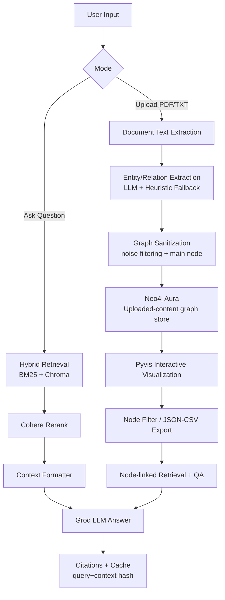

# Financial and Banking Domain Chatbot

A production-ready, domain-specific finance chatbot that combines Retrieval-Augmented Generation (RAG), citation grounding, knowledge graph extraction, and evaluation-driven CI.

## Overview

This project answers finance and banking questions using your curated corpus (SEC filings, RBI documents, and Fed statements) and always grounds responses in retrieved evidence.

Core outcomes:
- Domain-focused Q&A with source citations
- Hybrid retrieval quality (BM25 + vector + rerank)
- Interactive knowledge graph from uploaded user documents
- Async QA pipeline with in-memory context-aware cache
- RAGAS evaluation and CI gate for faithfulness
- LangSmith tracing for QA pipeline steps

## Implemented Features

### 1) Finance Q&A Chatbot
- Streamlit chat interface
- Institution filter (`JPM`, `GS`, `BAC`, `RBI`, `FED`)
- Hybrid retrieval (sparse + dense)
- Cohere reranking
- Citation-enforced answer generation
- Async retrieval and LLM calls
- In-memory LRU-style cache keyed by `(query + resolved context)` hash

### 2) Knowledge Graph from Uploaded Documents
- Upload `.pdf` or `.txt`
- LLM extraction of entities and relations with heuristic fallback
- Entity sanitization and noise filtering (removes weak nodes like stopwords/month-only tokens)
- Main-node detection from graph degree
- Interactive Pyvis graph rendering in Streamlit
- Node filtering
- Export graph as JSON and CSV
- Link graph nodes back to corpus retrieval and generate node-linked answers

### 3) Graph Persistence
- Neo4j Aura integration for graph storage
- Source-scoped graph writes
- Reload graph by source label
- Neo4j is used primarily to persist and visualize the user's own uploaded document graph

### 4) Evaluation and CI
- Golden dataset in `evaluation/golden_dataset.json`
- RAGAS metrics: faithfulness, answer relevancy, context precision
- Stability guards: strictness, run config tuning, NaN fail-fast
- GitHub Actions workflow for automated evaluation gate

### 5) Observability
- LangSmith tracing support for QA pipeline
- Function-level traced steps:
  - prompt formatting
  - LLM invocation
  - output parsing
  - end-to-end QA pipeline run

## Tech Stack

- Language: Python
- App framework: Streamlit
- Orchestration: LangChain
- LLM provider: Groq
  - QA: `llama-3.3-70b-versatile`
  - Eval/KG path (where configured): `llama-3.1-8b-instant`
- Embeddings: HuggingFace `sentence-transformers/all-MiniLM-L6-v2`
- Vector database: Chroma
- Sparse retrieval: BM25 (`rank-bm25`)
- Reranking: Cohere `rerank-english-v3.0`
- Chunking: `RecursiveCharacterTextSplitter` + `tiktoken` token-length function
- Graph database: Neo4j Aura
- Graph UI: Pyvis (embedded in Streamlit)
- Evaluation: RAGAS + HuggingFace datasets
- Tracing: LangSmith (`@traceable`)
- CI/CD: GitHub Actions
- PDF parsing: `pypdf`

## Data Corpus

Current corpus structure:

```
Data/
├── FED/
│   └── monetary20260128a1.pdf
├── RBI/
│   ├── PR6DFA5AD53D2D0414FAAB8D898975C40AA.PDF
│   └── PR19BD28196D176C4964A1C1E727002EF7AA.PDF
└── sec-edgar-filings/
    ├── BAC/
    │   └── bac-20231231.pdf
    ├── GS/
    │   └── 2025-10-k.pdf
    └── JPM/
        └── FORM 10-K: J.P. MORGAN CHASE & CO..pdf
```

## System Architecture

### Q&A flow

```
User Question
  -> Hybrid Retriever (BM25 + Chroma)
  -> Cohere Reranker
  -> Context Formatter
  -> Groq LLM
  -> Answer with Citations
  -> Query+Context Cache
```

### Knowledge graph flow

```
User Upload (.pdf/.txt)
  -> Text Extraction
  -> LLM/Heuristic Triple Extraction
  -> Neo4j (primary store for uploaded-content graph visualization)
  -> Graph Sanitization + Main Node Detection
  -> Neo4j Persist/Load
  -> Pyvis Interactive Visualization
  -> Node-linked Retrieval + QA
```

## Methodology Diagram



## Environment Variables

Set these in shell, Streamlit secrets, or `.env`:

- Required for QA:
  - `GROQ_API_KEY`
  - `COHERE_API_KEY`

- Optional for graph persistence:
  - `NEO4J_URI`
  - `NEO4J_USERNAME`
  - `NEO4J_PASSWORD`

- Optional for tracing:
  - `LANGSMITH_API_KEY` (or `LANGCHAIN_API_KEY`)
  - `LANGSMITH_PROJECT`
  - `LANGSMITH_TRACING=true`
  - `LANGSMITH_ENDPOINT=https://api.smith.langchain.com`

Important naming notes:
- Use `OPENAI_API_KEY` (not `OPEN_API_KEY`) if you ever add OpenAI usage.
- Use `NEO4J_URI` (not `NEOJ_URL`) for Neo4j connection URI.

## Run Locally

```bash
python -m venv venv
source venv/bin/activate
pip install -r requirements.txt  # if present
```

If you do not have a `requirements.txt`, install your current stack manually and run:

```bash
streamlit run app.py
```

## Evaluation

Run evaluation locally:

```bash
python evaluation/ragas_eval.py
```

CI workflow:
- Triggered on push/PR to `main`
- Rebuilds embeddings and runs RAGAS evaluation
- Fails build when quality gate is not met

## Project Structure

```
RAG-Domain/
├── app.py
├── qa_chain.py
├── hybrid_retriever.py
├── datachunking.py
├── embeddings.py
├── dataimport.py
├── Data/
├── chroma_db/
├── evaluation/
│   ├── golden_dataset.json
│   └── ragas_eval.py
└── .github/workflows/eval.yml
```

## What Is Done vs Next

Done:
- End-to-end domain chatbot
- Hybrid retrieval and citation grounding
- Async QA + cache
- Knowledge graph extraction, persistence, and visualization
- Node-linked QA from graph
- Eval + CI gate + tracing

Next improvements:
- Expand golden dataset (10 -> 50+)
- Add more multi-year filings
- Add requirements lockfile
- Add API layer (FastAPI) for deployment
- Add dashboard metrics for latency and faithfulness trends

## License

MIT